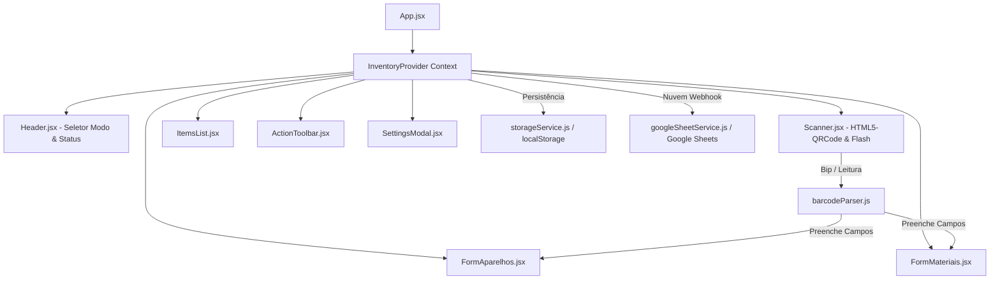

# 📐 Arquitetura do Sistema: Leitor de Inventário 2.0

## 📦 Fluxo de Dados e Componentes

---

## 🔑 Principais Módulos

### 1. `InventoryContext.jsx` (Estado Global)
Centraliza o estado de toda a aplicação:
* **Modo Ativo:** `'aparelhos'` ou `'materiais'`.
* **Listas Independentes:** Separação de itens contados para aparelhos e materiais.
* **Auto-aprendizado (Lookup DB):** Armazena vínculos entre códigos de barra e modelos/materiais.
* **Cache Offline:** Histórico e base do ERP para funcionamento mesmo sem conexão.

### 2. `barcodeParser.js` (Parser Inteligente)
Identifica automaticamente padrões por Regex:
* **Patrimônio:** `XXX.XX.XXX`
* **Consul Composto:** `Modelo + Série + Lote`
* **Elgin:** Séries com `ARC...` e Modelos `KVF...`
* **EAN-13:** Códigos numéricos de 8 a 14 dígitos

### 3. `useAudio.js` (Sintetizador Web Audio API)
Gera bipes sonoros diretamente pelo navegador sem dependência de arquivos externos de áudio:
* **Beep Positivo:** Onda senoidal rápida e suave a 1800Hz.
* **Buzina de Alerta:** Onda dente de serra descendente (360Hz $\rightarrow$ 180Hz) para duplicidades e divergências.
